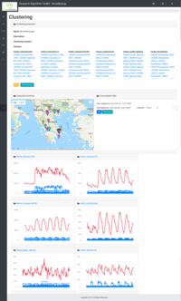
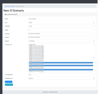
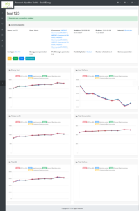
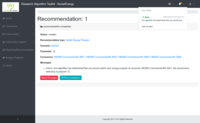

# README

This repository is the Research Algorithm Toolkit, developed in the context
of the Horizon 2020 SocialEnergy project http://socialenergy-project.eu/.

The purpose of this module is to allow administrators or privileged RAT users
to evaluate the performance of different pricing algorithms, on the portfolio
of the SocialEnergy user base.

The portal is available at https://rat.socialenergy-project.eu.

## Installation steps

The following steps have been tested on Ubuntu 16.04 and Ubuntu 18.04.
Please adapt accordingly for other distributions/OSs.

1.  Clone the repository into a directory on the local computer, and enter
    the directory. If `git` is not present it should be installed first.

        git clone https://github.com/socialenergy-project/rat.git
        cd rat/

2.  Install `ruby` version `2.4.1`, using `rbenv`. Installation instructions for
    `rbenv` may be found here https://github.com/rbenv/rbenv#installation

3.  Install postgres, create database user for rat, and setup a password:

        sudo apt install postgresql postgresql-contrib
        sudo apt install libpq-dev

        sudo -u postgres createuser rat -s
        sudo -u postgres psql
        postgres=# \password rat

4.  Setup the environment variables for the project. First create a `.env` file,
    using the provided sample:

        cp -i .env.sample .env

    and then edit the file to provide the appropriate values.

        SECRET_KEY_BASE=f24...
        RAT_DATABASE_PASSWORD=aCZ..

        SMTP_USERNAME=user@gmail.com
        SMTP_PASSWORD=pass

    - The value for `SECRET_KEY_BASE` variable is obtained by executing `rails secret`.
    - The value for `RAT_DATABASE_PASSWORD` variable is the password set for user
      `rat` in the previous step.
    - The values for `SMTP_USERNAME` and `SMTP_PASSWORD` are used for connecting
      to gmail to send emails. Different mail servers may be added by editing file
      `config/initializers/smtp_settings.rb`

5.  Install the required gems:

        bundle install

6.  Create the project database

        rails db:create
        rails db:migrate

7.  Now you can start the server with the command

        rails s

    You can then visit the site by opening a browser at http://localhost:3000/

8.  In order to be able to run the algorithms, you need to install the
    "pricing algorithms" submodule
    https://bitbucket.org/socialenergy-iccs/crtp_prtp_rtp,
    in a direct subdirectory of this repo, with the default name.

    Ensure that the submodule is installed correctly, by following the instruction
    in the corresponding README file.

9.  Ensure that the tests pass, with:

        rails test

## Registration and mock data

In order to use the RAT platform as a standalone platform, an admin user must be
created, and the database needs to be initialized with consumers and other objects.
Finally consumption data for the consumers must be added to the database.
The steps for this follow:

### Register admin user

1.  Start the server by running command `rails s` from the installation directory

2.  Open a browser window at location http://localhost:3000/ (or https://rat.socialenergy.eu)

3.  Register a new user using the `Sign up` link (or navigate to http://localhost:3000/users/sign_up).
    Set an email and a password and submit the form

4.  To make the user an administrator, navigate to the project
    directory, and execute:

        rails console

    In the prompt that appears execute the command:

        User.find_by(email: 'YOUR_EMAIL').add_role :admin

### Database initialization

1.  Decompress the file with consumption data:

        bunzip2 --keep db/initdata/DataPoint.csv.bz2

    A file named `db/initdata/DataPoint.csv` should be created.

2.  Run the script to seed the database with initial data:

        rails db:seed

    After this command, navigating to https://localhost:3000/, you should be able to see consumers,
    with consumption data for the dates from 1/1/2015 to 30/9/2016

## Navigation and visualization

A working demo the module may be found at https://rat.socialenergy-project.eu/, where anyone
can register an account.

The most important functionalities of the RAT module are the following :

1.  Consumption data visualization. Visit for expample the following links:
    - http://localhost:3000/consumers
    - http://localhost:3000/consumers/5001?start_date=2015-05-02T14%3A57%3A14.333%2B03%3A00&end_date=2015-05-09T14%3A57%3A14.333%2B03%3A00&interval_id=2
    - http://localhost:3000/communities/105
    - http://localhost:3000/clusterings/1

      

2.  Clustering algorithms:
    - To view the list of created clusterings, visit http://localhost:3000/clusterings/1
    - To create a new clustering, by executing a clustering algorithm,
      visit the link: http://localhost:3000/cl_scenarios/new.
      The dialog looks like this:

      
    - To view the list of clustering scenarios, in order to view their parameters and/or edit them,
      you can visit http://localhost:3000/cl_scenarios

3.  Evaluation of pricing mechanisms
    - To view the list of pricing scenarios, visit: http://localhost:3000/scenarios/
    - To create a new scenario to test the performance of each pricing algorithm under different
      conditions, visit http://localhost:3000/scenarios/new
    - After the scenario is created, you may see it in the url http://localhost:3000/scenarios/1.
      The results are depicted like in the screenshot below:

      

4.  Recommendation engine
    - To view all the recommendations that have been created visit: http://localhost:3000/recommendations/
    - To create a new recommendation visit: http://localhost:3000/recommendations/new
    - To preview a recommendation visit: http://localhost:3000/recommendations/1 (where the final number
      is the id of the recommendation)
    - To send the recommendation, click the button `Send`. The users that are associated with the consumers
      in the recommendation will be notified with a notification like in the screenshot bellow:

      